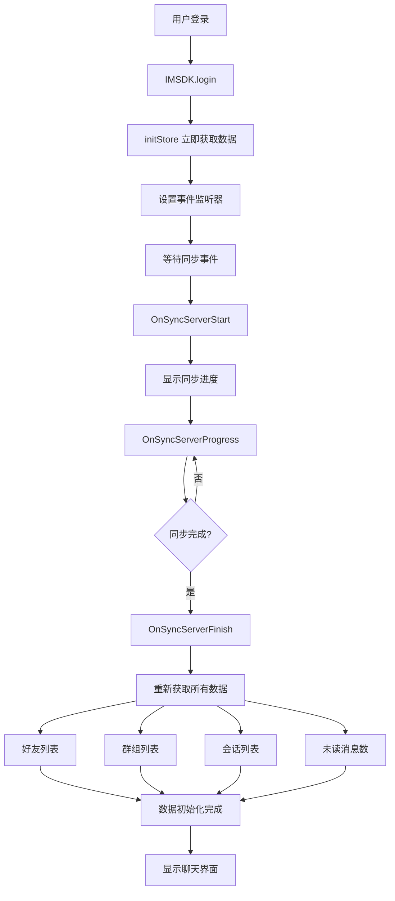

# 登录后同步数据逻辑详解

## 📋 概述

本文档详细说明了IM应用在用户登录后的数据同步逻辑，包括初始化流程、事件处理、数据获取机制等核心内容。

## 🎯 完整同步流程

### 1. 登录初始化阶段

**文件位置**: `src/layout/useGlobalEvents.tsx`

```typescript
useEffect(() => {
  loginCheck();        // 检查登录状态
  tryLogin();          // 尝试登录
  setIMListener();     // 设置事件监听器
}, []);
```

### 2. 登录成功后的处理

```typescript
const tryLogin = async () => {
  // ... 登录逻辑
  await IMSDK.login({ userID: IMUserID, token: IMToken });
  initStore(); // 🔥 关键：登录成功后立即初始化数据
};
```

### 3. 数据初始化 (initStore)

**文件位置**: `src/utils/imCommon.ts`

```typescript
export const initStore = () => {
  calcApplicationBadge();
  
  // 获取各种数据的方法
  const { getSelfInfoByReq } = useUserStore.getState();
  const { 
    getBlackListByReq, 
    getRecvFriendApplicationListByReq, 
    getRecvGroupApplicationListByReq,
    getSendFriendApplicationListByReq,
    getSendGroupApplicationListByReq,
  } = useContactStore.getState();
  const { getConversationListByReq, getUnReadCountByReq } = useConversationStore.getState();

  // 🔥 按顺序获取数据
  getUnReadCountByReq();           // 1. 未读消息数
  getConversationListByReq();      // 2. 会话列表
  getSelfInfoByReq();              // 3. 用户信息
  getBlackListByReq();             // 4. 黑名单
  getRecvFriendApplicationListByReq(); // 5. 收到的好友申请
  getRecvGroupApplicationListByReq();  // 6. 收到的群组申请
  getSendFriendApplicationListByReq(); // 7. 发送的好友申请
  getSendGroupApplicationListByReq();  // 8. 发送的群组申请
  getUnReadCountByReq();           // 9. 再次获取未读消息数
};
```

## 🔄 同步事件处理

### 1. 同步事件监听器设置

```typescript
const setIMListener = () => {
  // 同步相关事件
  IMSDK.on(CbEvents.OnSyncServerStart, syncStartHandler);    // 同步开始
  IMSDK.on(CbEvents.OnSyncServerProgress, syncProgressHandler); // 同步进度
  IMSDK.on(CbEvents.OnSyncServerFinish, syncFinishHandler);  // 同步完成
  IMSDK.on(CbEvents.OnSyncServerFailed, syncFailedHandler);  // 同步失败
};
```

### 2. 同步事件处理函数

```typescript
// 同步开始
const syncStartHandler = ({ data }: WSEvent<boolean>) => {
  updateSyncState("loading");  // 设置同步状态为加载中
  updateReinstallState(data);  // 更新重装状态
};

// 同步进度
const syncProgressHandler = ({ data }: WSEvent<number>) => {
  updateProgressState(data);   // 更新进度条
};

// 🔥 同步完成 - 重要节点
const syncFinishHandler = () => {
  updateSyncState("success");  // 设置同步状态为成功
  
  // 🔥 同步完成后重新获取所有数据
  getFriendListByReq();        // 获取好友列表
  getGroupListByReq();         // 获取群组列表  
  getConversationListByReq(false, true); // 获取会话列表
  getUnReadCountByReq();       // 获取未读消息数
};

// 同步失败
const syncFailedHandler = () => {
  updateSyncState("failed");
  feedbackToast({ msg: t("toast.syncFailed"), error: t("toast.syncFailed") });
};
```

## 📊 数据获取详情

### 1. 好友列表获取

**文件位置**: `src/store/contact.ts`

```typescript
getFriendListByReq: async () => {
  try {
    let offset = 0;
    let tmpList = [] as FriendUserItem[];
    let initialFetch = true;
    
    // 分页获取所有好友
    while (true) {
      const count = initialFetch ? 10000 : 1000;
      const { data } = await IMSDK.getFriendListPage({
        offset,
        count,
        filterBlack: true,
      });        
      tmpList = [...tmpList, ...data];
      offset += count;
      if (data.length < count) break;
      initialFetch = false;
    }
    
    set(() => ({ friendList: tmpList }));
  } catch (error) {
    feedbackToast({ error, msg: t("toast.getFriendListFailed") });
  }
}
```

### 2. 会话列表获取

**文件位置**: `src/store/conversation.ts`

```typescript
getConversationListByReq: async (isOffset?: boolean, forceLoading?: boolean) => {
  const IMToken = await getIMToken();
  if (!IMToken) {
    return false;
  }
  
  if (!forceLoading && !isOffset) set(() => ({ conversationIniting: true }));

  let tmpConversationList = [] as ConversationItem[];
  try {
    const { data } = await IMSDK.getConversationListSplit({
      offset: isOffset ? get().conversationList.length : 0,
      count: CONVERSATION_SPLIT_COUNT, // 500
    });
    tmpConversationList = data;
  } catch (error) {
    if (!isOffset) set(() => ({ conversationIniting: false }));
    return true;
  }
  
  set((state) => ({
    conversationList: limitArraySize([
      ...(isOffset ? state.conversationList : []),
      ...tmpConversationList,
    ], MAX_CONVERSATION_LIST_SIZE), // 2000
  }));
  
  if (!forceLoading && !isOffset) set(() => ({ conversationIniting: false }));
  return tmpConversationList.length === CONVERSATION_SPLIT_COUNT;
}
```

### 3. 用户信息获取

**文件位置**: `src/store/user.ts`

```typescript
getSelfInfoByReq: async () => {
  try {
    const IMToken = await getIMToken();
    if (!IMToken) {
      return false;
    }
    
    // 1. 获取IM用户信息
    const { data: imData } = await IMSDK.getSelfUserInfo();
    set(() => ({ selfInfo: imData as unknown as BusinessUserInfo }));
    
    // 2. 获取业务用户信息
    const { data: { users } } = await getBusinessUserInfo([imData.userID]);
    
    // 3. 获取角色权限
    const { data: rolePermissions } = await get_self_org_role_permission();
    const permissions = rolePermissions.map(v => v.permission_code);
    users[0].permissions = permissions;
    
    // 4. 合并信息
    set((state) => ({ selfInfo: { ...state.selfInfo, ...users[0] } }));
  } catch (error) {
    get().userLogout();
  }
}
```

## 🎯 同步逻辑总结

### 双重数据获取机制

1. **登录后立即获取** (`initStore`)：
   - 登录成功后立即获取基础数据
   - 确保用户能快速看到界面
   - 提升用户体验

2. **同步完成后重新获取** (`syncFinishHandler`)：
   - 服务器同步完成后再次获取最新数据
   - 确保数据完整性和一致性
   - 避免数据丢失

### 同步状态管理

```typescript
// 同步状态：loading → success/failed
syncState: "loading" | "success" | "failed"
progress: number  // 0-100 的进度
```

### 数据获取顺序

1. **基础数据**：未读消息数、会话列表、用户信息
2. **社交数据**：好友列表、群组列表、黑名单
3. **申请数据**：收到/发送的好友申请、群组申请
4. **最终确认**：再次获取未读消息数

## 🔧 优化建议

### 1. 批量更新优化

**当前实现**：每次收到会话更新都立即处理
**优化方案**：实现批量更新机制

```typescript
// 批量会话更新处理 - 每秒更新一次
let pendingConversationUpdates: ConversationItem[] = [];
let batchUpdateTimer: NodeJS.Timeout | null = null;
const BATCH_UPDATE_INTERVAL = 1000; // 1秒批量更新一次

const conversationChnageHandler = ({ data }: WSEvent<ConversationItem[]>) => {
  // 缓存推送的会话更新
  pendingConversationUpdates.push(...data);
  
  // 如果还没有启动批量更新定时器，则启动
  if (!batchUpdateTimer) {
    batchUpdateTimer = setInterval(() => {
      if (pendingConversationUpdates.length > 0) {
        // 去重并保留最新的数据
        const uniqueUpdates = new Map<string, ConversationItem>();
        pendingConversationUpdates.forEach(conv => {
          const existing = uniqueUpdates.get(conv.conversationID);
          if (!existing || conv.latestMsgSendTime > existing.latestMsgSendTime) {
            uniqueUpdates.set(conv.conversationID, conv);
          }
        });
        
        const finalUpdates = Array.from(uniqueUpdates.values());
        updateConversationList(finalUpdates, "filter");
        pendingConversationUpdates = [];
      }
    }, BATCH_UPDATE_INTERVAL);
  }
};
```

### 2. 动态时间间隔

```typescript
// 动态时间间隔设置
const getDynamicInterval = () => {
  const now = Date.now();
  const timeDiff = now - lastUpdateTime;
  
  // 根据更新频率动态调整
  if (updateCount > 20) {
    return 300;  // 高频更新：使用较短间隔
  } else if (updateCount > 10) {
    return 500;  // 中频更新：平衡性能和响应性
  } else if (updateCount > 5) {
    return 800;  // 低频更新：使用较长间隔
  } else {
    return 1000; // 极低频更新：使用最长间隔
  }
};
```

### 3. 错误处理和重试机制

```typescript
// 添加重试机制
const retryDataFetch = async (fetchFunction: () => Promise<any>, maxRetries = 3) => {
  for (let i = 0; i < maxRetries; i++) {
    try {
      return await fetchFunction();
    } catch (error) {
      if (i === maxRetries - 1) {
        throw error;
      }
      // 指数退避
      await new Promise(resolve => setTimeout(resolve, Math.pow(2, i) * 1000));
    }
  }
};
```

## 📈 性能监控

### 1. 同步性能指标

```typescript
// 性能监控
const startTime = performance.now();
const batchSize = pendingConversationUpdates.length;

try {
  const mergedUpdates = mergeConversationUpdates(pendingConversationUpdates);
  updateConversationList(mergedUpdates, "filter");
  
  const endTime = performance.now();
  const duration = endTime - startTime;
  
  console.log(`🔥 会话批量更新完成: 处理${batchSize}条，合并为${mergedUpdates.length}条，耗时${duration.toFixed(2)}ms`);
} catch (error) {
  console.error('处理会话更新失败:', error);
}
```

### 2. 数据量监控

```typescript
// 监控数据量
const monitorDataSize = () => {
  const conversationCount = useConversationStore.getState().conversationList.length;
  const friendCount = useContactStore.getState().friendList.length;
  const groupCount = useContactStore.getState().groupList.length;
  
  console.log(`📊 数据量统计: 会话${conversationCount}个，好友${friendCount}个，群组${groupCount}个`);
};
```

## 🎯 设计优势

这种设计确保了：

- **快速响应**：登录后立即显示基础数据
- **数据完整**：同步完成后获取最新数据
- **状态一致**：通过状态管理避免重复请求
- **用户体验**：进度条显示同步状态
- **性能优化**：批量处理减少渲染压力
- **错误恢复**：完善的错误处理机制

## 📝 注意事项

1. **内存管理**：及时清理定时器和缓存数据
2. **网络优化**：合理设置重试间隔和超时时间
3. **用户体验**：避免频繁的UI更新和闪烁
4. **数据一致性**：确保最终显示的是最新数据
5. **错误处理**：优雅处理网络异常和数据获取失败

## 🔄 流程图



## 📁 关键文件列表

| 文件路径 | 功能描述 |
|---------|---------|
| `src/layout/useGlobalEvents.tsx` | 全局事件监听和同步处理 |
| `src/utils/imCommon.ts` | 数据初始化函数 |
| `src/store/user.ts` | 用户状态管理 |
| `src/store/contact.ts` | 联系人状态管理 |
| `src/store/conversation.ts` | 会话状态管理 |
| `src/layout/MainContentLayout.tsx` | 主布局和加载状态显示 | 