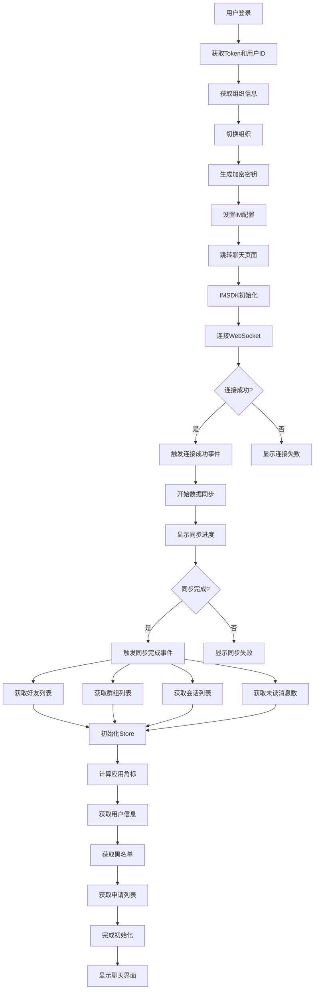

# 登录后同步数据逻辑详解

## 📋 目录
- [概述](#概述)
- [登录流程](#登录流程)
- [IMSDK连接流程](#imsdk连接流程)
- [数据同步流程](#数据同步流程)
- [数据初始化](#数据初始化)
- [状态管理](#状态管理)
- [错误处理](#错误处理)
- [性能优化](#性能优化)
- [流程图](#流程图)

## 概述

本文档详细说明了IM Electron应用在用户登录成功后，如何同步和初始化各种数据的完整流程。整个同步过程分为登录、连接、同步、初始化四个主要阶段。

## 登录流程

### 1. 用户登录处理

**文件位置**: `src/pages/login/LoginForm.tsx`

```typescript
const onFinish = (params: API.Login.LoginParams) => {
  login(params, {
    onSuccess: async (data) => {
      const { chatToken, imToken, userID } = data.data;
      
      // 1. 获取组织信息
      const orgres = await selectAllOrg(chatToken);
      const allOrgs = orgres.data.data;
      
      // 2. 处理组织切换
      const orgids = allOrgs.map((org) => org.organization_id);
      let current_org_id = localStorage.getItem("current_org_id");
      if (!current_org_id || !orgids.includes(current_org_id)) {
        const currentOrg = allOrgs[0];
        localStorage.setItem("current_org_id", currentOrg.organization_id);
        localStorage.setItem("current_org_role", currentOrg.role);
        current_org_id = currentOrg.organization_id;
      }
      
      // 3. 切换组织并获取新的IM Token
      const imres = await changeOrg(chatToken, current_org_id);
      const { im_token, im_server_user_id } = imres.data;
      
      // 4. 设置IM配置
      setIMProfile({ chatToken, imToken: im_token, userID: im_server_user_id });
      
      // 5. 生成加密密钥
      const { privateKey, publicKey } = generateRSAKeyPair();
      localStorage.setItem("rsaPrivateKey", privateKey);
      
      // 6. 获取AES密钥
      const { data: { encrypted_aes_key } } = await getAESkey(publicKey, chatToken);
      const aesKey = decryptAESKey(encrypted_aes_key, privateKey);
      localStorage.setItem("AES_KEY", aesKey);
      
      // 7. 检查钱包状态
      const { data: walletData } = await checkWalletExist(chatToken);
      localStorage.setItem("walletExist", walletData);
      
      // 8. 跳转到聊天页面
      navigate("/chat", { flushSync: true });
    },
  });
};
```

### 2. 登录检查

**文件位置**: `src/layout/MainContentWrap.tsx`

```typescript
const loginCheck = async () => {
  const IMToken = await getIMToken();
  const IMUserID = await getIMUserID();

  if (!IMToken || !IMUserID) {
    if (isElectron) {
      navigate("/login");
      return;
    }
    if (location.pathname !== "/" && 
        location.pathname !== "/privacy" && 
        location.pathname !== "/lucky-wheel" && 
        location.pathname !== "/account-delete") {
      navigate("/login");
      return;
    }
  }
};
```

## IMSDK连接流程

### 1. 尝试登录

**文件位置**: `src/layout/useGlobalEvents.tsx`

```typescript
const tryLogin = async () => {
  updateIsLogining(true);
  const IMToken = (await getIMToken()) as string;
  const IMUserID = (await getIMUserID()) as string;
  
  try {
    // 配置服务器地址
    let apiAddr = globalConfig.apiUrl;
    let wsAddr = globalConfig.wsUrl;
    let chatAddr = globalConfig.chatUrl;
    
    // 处理WebSocket地址
    if (!wsAddr || (!wsAddr.startsWith('ws://') && !wsAddr.startsWith('wss://'))) {
      const currentHost = window.location.hostname;
      const protocol = window.location.protocol === 'https:' ? 'wss:' : 'ws:';
      const isIpAddress = /^(\d{1,3}\.){3}\d{1,3}$/.test(currentHost);
      
      if (isIpAddress && import.meta.env.VITE_WS_URL1) {
        wsAddr = `${protocol}//${currentHost}${import.meta.env.VITE_WS_URL1}`;
      } else {
        wsAddr = `${protocol}//${currentHost}${wsAddr}`;
      }
    }
    
    // 处理API地址
    if (!apiAddr || (!apiAddr.startsWith('http://') && !apiAddr.startsWith('https://'))) {
      const currentHost = window.location.hostname;
      const protocol = window.location.protocol;
      const isIpAddress = /^(\d{1,3}\.){3}\d{1,3}$/.test(currentHost);
      
      if (isIpAddress && import.meta.env.VITE_API_URL1) {
        apiAddr = `${protocol}//${currentHost}${import.meta.env.VITE_API_URL1}`;
      } else {
        apiAddr = `${protocol}//${currentHost}${apiAddr}`;
      }
    }
    
    // 更新环境变量
    import.meta.env.VITE_API_URL = apiAddr;
    import.meta.env.VITE_WS_URL = wsAddr;
    
    // 初始化SDK并登录
    if (window.electronAPI) {
      await IMSDK.initSDK({
        platformID: window.electronAPI?.getPlatform() ?? 5,
        apiAddr,
        wsAddr,
        dataDir: window.electronAPI.getDataPath("sdkResources") || "./",
        logFilePath: window.electronAPI.getDataPath("logsPath") || "./",
        logLevel: LogLevel.Debug,
        isLogStandardOutput: false,
        systemType: "electron",
      });
      await IMSDK.login({
        userID: IMUserID,
        token: IMToken,
      });
    } else {
      await IMSDK.login({
        userID: IMUserID,
        token: IMToken,
        platformID: 5,
        apiAddr,
        wsAddr,
        logLevel: LogLevel.Debug,
      });
    }
    
    initStore();
  } catch (error) {
    if ((error as WsResponse).errCode !== 10102) {
      navigate("/login");
    }
  }
  updateIsLogining(false);
};
```

### 2. 连接事件处理

```typescript
// 连接中
const connectingHandler = () => {
  updateConnectState("loading");
};

// 连接失败
const connectFailedHandler = ({ errCode, errMsg }: WSEvent) => {
  updateConnectState("failed");
  console.error("connectFailedHandler", errCode, errMsg);
  
  if (errCode === 705) {
    tryOut(t("toast.loginExpiration"));
  }
};

// 连接成功
const connectSuccessHandler = async () => {
  updateConnectState("success");
  
  // 检查是否有待添加的邀请人
  const pendingInviteUserID = localStorage.getItem("pending_invite_user_id");
  if (pendingInviteUserID) {
    try {
      await IMSDK.addFriend({
        toUserID: pendingInviteUserID,
        reqMsg: t("toast.autoAddFriendByInvite") || "感谢邀请，系统自动添加好友"
      });
      message.success(t("toast.sendFreiendRequestSuccess") || "好友申请发送成功");
      localStorage.removeItem("pending_invite_user_id");
    } catch (error) {
      message.error(t("toast.sendFreiendRequestFail") || "好友申请发送失败");
    }
  }
};
```

## 数据同步流程

### 1. 同步事件监听

```typescript
const setIMListener = () => {    
  // 账户相关事件
  IMSDK.on(CbEvents.OnSelfInfoUpdated, selfUpdateHandler);
  IMSDK.on(CbEvents.OnConnecting, connectingHandler);
  IMSDK.on(CbEvents.OnConnectFailed, connectFailedHandler);
  IMSDK.on(CbEvents.OnConnectSuccess, connectSuccessHandler);
  IMSDK.on(CbEvents.OnKickedOffline, kickHandler);
  IMSDK.on(CbEvents.OnUserTokenExpired, expiredHandler);
  IMSDK.on(CbEvents.OnUserTokenInvalid, expiredHandler);
  
  // 同步相关事件
  IMSDK.on(CbEvents.OnSyncServerStart, syncStartHandler);
  IMSDK.on(CbEvents.OnSyncServerProgress, syncProgressHandler);
  IMSDK.on(CbEvents.OnSyncServerFinish, syncFinishHandler);
  IMSDK.on(CbEvents.OnSyncServerFailed, syncFailedHandler);
  
  // 消息相关事件
  IMSDK.on(CbEvents.OnRecvNewMessages, newMessageHandler);
  IMSDK.on(CbEvents.OnRecvC2CReadReceipt, c2cReadReceipt);
  IMSDK.on(CbEvents.OnNewRecvMessageRevoked, revokedMessageHandler);
  
  // 会话相关事件
  IMSDK.on(CbEvents.OnConversationChanged, conversationChnageHandler);
  IMSDK.on(CbEvents.OnNewConversation, newConversationHandler);
  IMSDK.on(CbEvents.OnTotalUnreadMessageCountChanged, totalUnreadChangeHandler);
  
  // 好友相关事件
  IMSDK.on(CbEvents.OnFriendInfoChanged, friednInfoChangeHandler);
  IMSDK.on(CbEvents.OnFriendAdded, friednAddedHandler);
  IMSDK.on(CbEvents.OnFriendDeleted, friednDeletedHandler);
  
  // 黑名单相关事件
  IMSDK.on(CbEvents.OnBlackAdded, blackAddedHandler);
  IMSDK.on(CbEvents.OnBlackDeleted, blackDeletedHandler);
  
  // 群组相关事件
  IMSDK.on(CbEvents.OnJoinedGroupAdded, joinedGroupAddedHandler);
  IMSDK.on(CbEvents.OnJoinedGroupDeleted, joinedGroupDeletedHandler);
  IMSDK.on(CbEvents.OnGroupDismissed, joinedGroupDismissHandler);
  IMSDK.on(CbEvents.OnGroupInfoChanged, groupInfoChangedHandler);
  IMSDK.on(CbEvents.OnGroupMemberAdded, groupMemberAddedHandler);
  IMSDK.on(CbEvents.OnGroupMemberDeleted, groupMemberDeletedHandler);
  IMSDK.on(CbEvents.OnGroupMemberInfoChanged, groupMemberInfoChangedHandler);
  
  // 申请相关事件
  IMSDK.on(CbEvents.OnFriendApplicationAdded, friendApplicationProcessedHandler);
  IMSDK.on(CbEvents.OnFriendApplicationAccepted, friendApplicationProcessedHandler);
  IMSDK.on(CbEvents.OnFriendApplicationRejected, friendApplicationProcessedHandler);
  IMSDK.on(CbEvents.OnGroupApplicationAdded, groupApplicationProcessedHandler);
  IMSDK.on(CbEvents.OnGroupApplicationAccepted, groupApplicationProcessedHandler);
  IMSDK.on(CbEvents.OnGroupApplicationRejected, groupApplicationProcessedHandler);
};
```

### 2. 同步事件处理

```typescript
// 同步开始
const syncStartHandler = ({ data }: WSEvent<boolean>) => {
  updateSyncState("loading");
  updateReinstallState(data);
};

// 同步进度
const syncProgressHandler = ({ data }: WSEvent<number>) => {
  updateProgressState(data);
};

// 同步完成 - 关键节点
const syncFinishHandler = () => {
  updateSyncState("success");
  getFriendListByReq();        // 获取好友列表
  getGroupListByReq();         // 获取群组列表  
  getConversationListByReq(false, true); // 获取会话列表
  getUnReadCountByReq();       // 获取未读消息数
};

// 同步失败
const syncFailedHandler = () => {
  updateSyncState("failed");
  feedbackToast({ msg: t("toast.syncFailed"), error: t("toast.syncFailed") });
};
```

## 数据初始化

### 1. initStore函数

**文件位置**: `src/utils/imCommon.ts`

```typescript
export const initStore = () => {
  calcApplicationBadge(); // 计算应用角标
  
  const { getSelfInfoByReq } = useUserStore.getState();
  const {
    getBlackListByReq,
    getRecvFriendApplicationListByReq,
    getRecvGroupApplicationListByReq,
    getSendFriendApplicationListByReq,
    getSendGroupApplicationListByReq,
  } = useContactStore.getState();
  const { getConversationListByReq, getUnReadCountByReq } =
    useConversationStore.getState();

  // 按顺序获取各种数据
  getUnReadCountByReq();           // 未读消息数
  getConversationListByReq();      // 会话列表
  getSelfInfoByReq();              // 用户信息
  getBlackListByReq();             // 黑名单
  getRecvFriendApplicationListByReq(); // 收到的好友申请
  getRecvGroupApplicationListByReq();  // 收到的群组申请
  getSendFriendApplicationListByReq(); // 发送的好友申请
  getSendGroupApplicationListByReq();  // 发送的群组申请
  getUnReadCountByReq();           // 再次获取未读消息数
};
```

### 2. 好友列表获取

**文件位置**: `src/store/contact.ts`

```typescript
getFriendListByReq: async () => {
  try {
    let offset = 0;
    let tmpList = [] as FriendUserItem[];
    let initialFetch = true;
    
    // 分页获取所有好友
    while (true) {
      const count = initialFetch ? 10000 : 1000;
      const { data } = await IMSDK.getFriendListPage({
        offset,
        count,
        filterBlack: true,
      });        
      tmpList = [...tmpList, ...data];
      offset += count;
      if (data.length < count) break;
      initialFetch = false;
    }
    
    set(() => ({ friendList: tmpList }));
  } catch (error) {
    feedbackToast({ error, msg: t("toast.getFriendListFailed") });
  }
}
```

### 3. 群组列表获取

```typescript
getGroupListByReq: async () => {
  try {
    let offset = 0;
    let tmpList = [] as GroupItem[];
    let initialFetch = true;
    
    // 分页获取所有群组
    while (true) {
      const count = initialFetch ? 10000 : 1000;
      const { data } = await IMSDK.getJoinedGroupListPage({
        offset,
        count,
      });        
      tmpList = [...tmpList, ...data];
      offset += count;
      if (data.length < count) break;
      initialFetch = false;
    }
    
    set(() => ({ groupList: tmpList }));
  } catch (error) {
    feedbackToast({ error, msg: t("toast.getGroupListFailed") });
  }
}
```

### 4. 会话列表获取

**文件位置**: `src/store/conversation.ts`

```typescript
getConversationListByReq: async (isOffset?: boolean, forceLoading?: boolean) => {
  const IMToken = await getIMToken();
  if (!IMToken) {
    return false;
  }
  
  if (!forceLoading && !isOffset) set(() => ({ conversationIniting: true }));

  let tmpConversationList = [] as ConversationItem[];
  try {
    const { data } = await IMSDK.getConversationListSplit({
      offset: isOffset ? get().conversationList.length : 0,
      count: CONVERSATION_SPLIT_COUNT,
    });
    tmpConversationList = data;
  } catch (error) {
    if (!isOffset) set(() => ({ conversationIniting: false }));
    return true;
  }
  
  set((state) => ({
    conversationList: limitArraySize([
      ...(isOffset ? state.conversationList : []),
      ...tmpConversationList,
    ], MAX_CONVERSATION_LIST_SIZE),
  }));
  
  if (!forceLoading && !isOffset) set(() => ({ conversationIniting: false }));
  return tmpConversationList.length === CONVERSATION_SPLIT_COUNT;
}
```

### 5. 用户信息获取

**文件位置**: `src/store/user.ts`

```typescript
getSelfInfoByReq: async () => {
  try {
    const IMToken = await getIMToken();
    if (!IMToken) {
      return false;
    }
    
    // 获取IM用户信息
    const { data: imData } = await IMSDK.getSelfUserInfo();
    set(() => ({ selfInfo: imData as unknown as BusinessUserInfo }));
    
    // 获取业务用户信息
    const { data: { users } } = await getBusinessUserInfo([imData.userID]);
    
    // 获取角色权限
    const { data: rolePermissions } = await get_self_org_role_permission();
    const permissions = rolePermissions.map(v => v.permission_code);
    users[0].permissions = permissions;
    
    set((state) => ({ selfInfo: { ...state.selfInfo, ...users[0] } }));
  } catch (error) {
    get().userLogout();
  }
}
```

## 状态管理

### 1. 同步状态定义

**文件位置**: `src/store/user.ts`

```typescript
export interface UserStore {
  syncState: IMConnectState;    // 同步状态: loading/success/failed
  progress: number;             // 同步进度 0-100
  reinstall: boolean;           // 是否重新安装
  isLogining: boolean;          // 是否正在登录
  connectState: IMConnectState; // 连接状态
  selfInfo: BusinessUserInfo;   // 用户信息
  appSettings: AppSettings;     // 应用设置
  isWalletOpened: boolean;      // 钱包是否打开
  walletBalance: number;        // 钱包余额
}
```

### 2. 状态更新函数

```typescript
updateSyncState: (syncState: IMConnectState) => {
  set({ syncState });
},

updateProgressState: (progress: number) => {
  set({ progress });
},

updateReinstallState: (reinstall: boolean) => {
  set({ reinstall });
},

updateIsLogining: (isLogining: boolean) => {
  set({ isLogining });
},

updateConnectState: (connectState: IMConnectState) => {
  set({ connectState });
}
```

### 3. UI状态显示

**文件位置**: `src/layout/MainContentLayout.tsx`

```typescript
const loadingTip = isLogining ? t("toast.loading") : `${progress}%`;
const showLockLoading = isLogining || (reinstall && syncState === "loading");

return (
  <Spin className="!max-h-none" spinning={showLockLoading} tip={loadingTip}>
    <Layout className="h-full">
      <TopSearchBar />
      <Layout>
        <LeftNavBar />
        <Outlet />
      </Layout>
    </Layout>
  </Spin>
);
```

## 错误处理

### 1. 连接失败处理

```typescript
const connectFailedHandler = ({ errCode, errMsg }: WSEvent) => {
  updateConnectState("failed");
  console.error("connectFailedHandler", errCode, errMsg);
  
  if (errCode === 705) {
    tryOut(t("toast.loginExpiration"));
  }
};
```

### 2. 同步失败处理

```typescript
const syncFailedHandler = () => {
  updateSyncState("failed");
  feedbackToast({ msg: t("toast.syncFailed"), error: t("toast.syncFailed") });
};
```

### 3. 踢下线处理

```typescript
const kickHandler = () => {
  Modal.confirm({
    content: t("toast.AccountLoggedInElsewhere"),
    onOk: () => {
      window.location.reload();
    },
    onCancel: () => {
      navigate("/login");
      setTimeout(() => {
        window.close();
      }, 100);
    },
    okText: t("toast.KeepCurrentPage"),
    cancelText: t("toast.DestroyCurrentPage"),
  });
};
```

### 4. Token过期处理

```typescript
const expiredHandler = () => tryOut(t("toast.loginExpiration"));

const tryOut = (msg: string) =>
  feedbackToast({
    msg,
    error: msg,
    onClose: () => {
      userLogout(true);
    },
  });
```

## 性能优化

### 1. 分页加载

- **好友列表**: 首次加载10000条，后续每次1000条
- **群组列表**: 首次加载10000条，后续每次1000条
- **会话列表**: 每次加载20条，支持分页加载更多

### 2. 数据限制

```typescript
const MAX_CONVERSATION_LIST_SIZE = 2000; // 会话列表最大数量
const CONVERSATION_SPLIT_COUNT = 500;    // 会话分页大小
```

### 3. 缓存机制

- 使用Zustand进行状态管理，避免重复请求
- 本地存储Token和用户信息
- 应用角标计算缓存

### 4. 网络状态监听

```typescript
const handleOnline = () => {
  IMSDK.networkStatusChanged();
};

const handleOffline = () => {
  IMSDK.networkStatusChanged();
};

window.addEventListener("online", handleOnline);
window.addEventListener("offline", handleOffline);
```

## 流程图



## 关键文件列表

| 文件路径 | 功能描述 |
|---------|---------|
| `src/pages/login/LoginForm.tsx` | 登录表单处理 |
| `src/layout/useGlobalEvents.tsx` | 全局事件监听和同步处理 |
| `src/utils/imCommon.ts` | 数据初始化函数 |
| `src/store/user.ts` | 用户状态管理 |
| `src/store/contact.ts` | 联系人状态管理 |
| `src/store/conversation.ts` | 会话状态管理 |
| `src/layout/MainContentLayout.tsx` | 主布局和加载状态显示 |

## 注意事项

1. **同步顺序**: 先连接，再同步，最后初始化数据
2. **错误处理**: 每个阶段都有相应的错误处理机制
3. **状态管理**: 使用Zustand进行全局状态管理
4. **性能优化**: 采用分页加载和缓存机制
5. **用户体验**: 提供进度显示和错误提示
6. **网络适应**: 支持网络断开重连和数据重新同步 